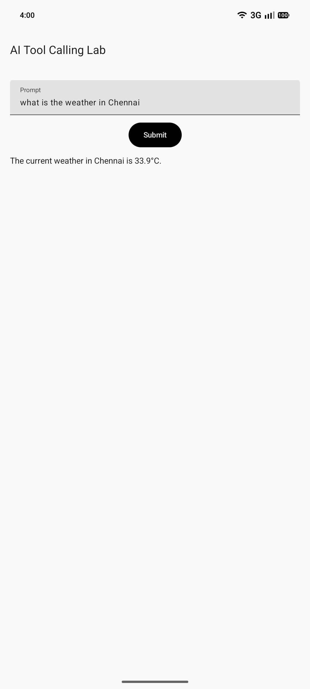
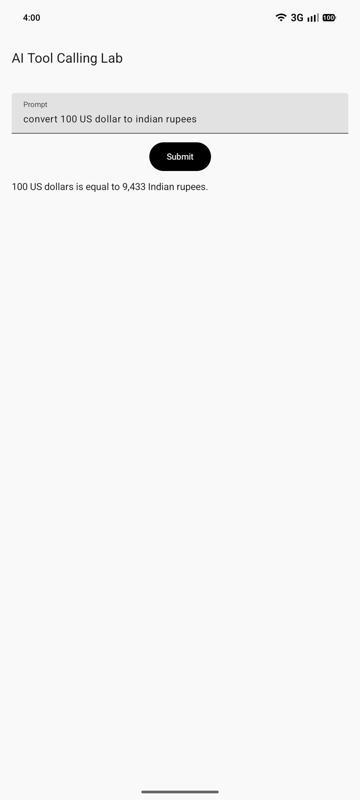
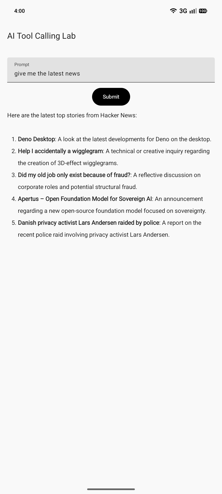

# AI Tool Calling Lab – Exploring Tool Calling & Agent Architectures

AI Tool Calling Lab is an Android application built for experimenting with LLM-powered tool calling, agent architectures, and external API integrations using Google's Gemini API.

## Why This Project Exists

This project was created as a hands-on learning laboratory for understanding how modern AI applications evolve from simple prompt-based systems into tool-enabled agents capable of interacting with external services and APIs.

The goal is to explore real-world AI application patterns such as tool calling, agent workflows, function calling, ReAct agents, and Retrieval-Augmented Generation (RAG).

## Screenshots

<p>



</p>

## Screenshots

| Weather Tool | Currency Tool | News Tool |
|-------------|-------------|-------------|
||||

## Features

- Tool Calling Experiments
- Multi-Tool Agent Architecture
- Agent Execution Loop
- Tool Registry & Tool Executor
- Tool Metadata Driven Prompting
- Calculator Tool
- Weather Tool
- Currency Tool
- News Tool
- Prompt Engineering Experiments
- System Instruction Testing
- Context Management Experiments
- External API Integration
- Markdown Rendering
- Robust Error Handling
- Jetpack Compose UI

## Tech Stack

### Language
- Kotlin

### UI
- Jetpack Compose
- Material 3

### Architecture
- MVVM
- Repository Pattern
- Kotlin Coroutines

### AI
- Google GenAI SDK (Gemini)

### Networking
- Retrofit
- Gson Converter

### Serialization
- Kotlinx Serialization

### Markdown Rendering
- compose-markdown

## Prerequisites

- Android Studio Ladybug (2024.2.1) or newer.
- A Gemini API Key from the [Google AI Studio](https://aistudio.google.com/).

## Setup

1.  **Clone the repository**:
    ```bash
    git clone <repository-url>
    ```
2.  **Add your API Key**:
    Open the `local.properties` file in the root directory and add your key:
    ```properties
    GEMINI_API_KEY=your_actual_api_key_here
    ```
3.  **Sync and Run**:
    Sync the project with Gradle files and run the `app` module on an emulator or physical device.

## Learning Journey

This repository documents a progression through modern LLM application patterns:

1. Basic Chat Applications
2. Prompt Engineering
3. System Instructions
4. Context Management
5. Tool Calling
6. Multi-Tool Agents
7. Function Calling
8. ReAct Agents
9. Retrieval-Augmented Generation (RAG)
10. Agentic Workflows

## AI Concepts Explored

### Prompt Engineering
Experimenting with prompt design techniques to influence model behavior and response quality.

### System Instructions
Using system-level instructions to define model behavior and response boundaries.

### Context Management
Passing conversation history to maintain continuity across interactions.

### Tool Calling
Experimenting with external tool execution and integrating tool results into AI workflows.

### Agent Architecture

Experimenting with agentic workflows where the LLM can:

- Decide when a tool is needed
- Select the appropriate tool
- Generate tool inputs
- Execute tools
- Incorporate tool results into final responses

### External API Integration
Using Retrofit to connect AI tools with real-world data sources such as weather, currency, and news services.

### Error Handling
Handling API failures, quota limits, and retry mechanisms.

## Agent Architecture

```text
User Prompt
    ↓
ChatRunner
    ↓
Agent
    ↓
Gemini
    ↓
Tool Selection Prompt
    ↓
Tool Call Parser
    ↓
ToolExecutor
    ↓
ToolRegistry
    ↓
Selected Tool
    ↓
External API / Local Logic
    ↓
Tool Result
    ↓
Gemini
    ↓
Final Response
```

## Tool Selection Workflow

The agent follows a two-step reasoning process:

```text
User Question
    ↓
Gemini selects a tool
    ↓
Tool executes
    ↓
Tool result returned to Gemini
    ↓
Gemini generates final answer
```

Example:

User:
```
What's the weather in Chennai?
```

Agent:
```
TOOL: weather
INPUT: Chennai
```

Tool:
```
Temperature: 34°C
Condition: Sunny
```

Final Answer:
```
The current weather in Chennai is 34°C and sunny.
```

### Implemented tools:

| Tool | Implementation |
|--------|--------|
| Calculator Tool | Local Logic |
| Weather Tool | External API |
| Currency Tool | External API |
| News Tool | External API |

## Roadmap

### Completed

- [x] Basic Gemini Integration
- [x] Calculator Tool
- [x] Weather Tool
- [x] Currency Tool
- [x] News Tool
- [x] Tool Registry & Tool Executor Architecture
- [x] Tool Selection Logic
- [x] Tool Call Parsing
- [x] Multi-Tool Agent
- [x] Agent Loop
- [x] Markdown Rendering

### Future Experiments

- [ ] Function Calling
- [ ] Structured Tool Arguments
- [ ] Multi-Step Tool Execution
- [ ] ReAct Agents
- [ ] Agent Memory
- [ ] Multi-Agent Systems
- [ ] MCP Integration
- [ ] RAG Experiments
- [ ] Local LLM Integration

## Project Structure

```text
com.sri.aitoolcallinglab

├── agent
│   ├── Agent
│   ├── AgentResult
│   ├── ToolCallParser
│   └── ToolSelectionPromptBuilder
│
├── tool
│   ├── Tool
│   ├── ToolRegistry
│   ├── ToolExecutor
│   ├── ToolCall
│   ├── ToolExample
│   ├── calculator
│   ├── currency
│   ├── news
│   └── weather
│
├── llm
│   ├── AIModel
│   ├── LlmClient
│   ├── GeminiLlmClient
│   └── GeminiRepository
│
├── chat
│   └── ChatRunner
│
├── ui
│   ├── MainActivity
│   ├── MainViewModel
│   └── ChatUiState
```